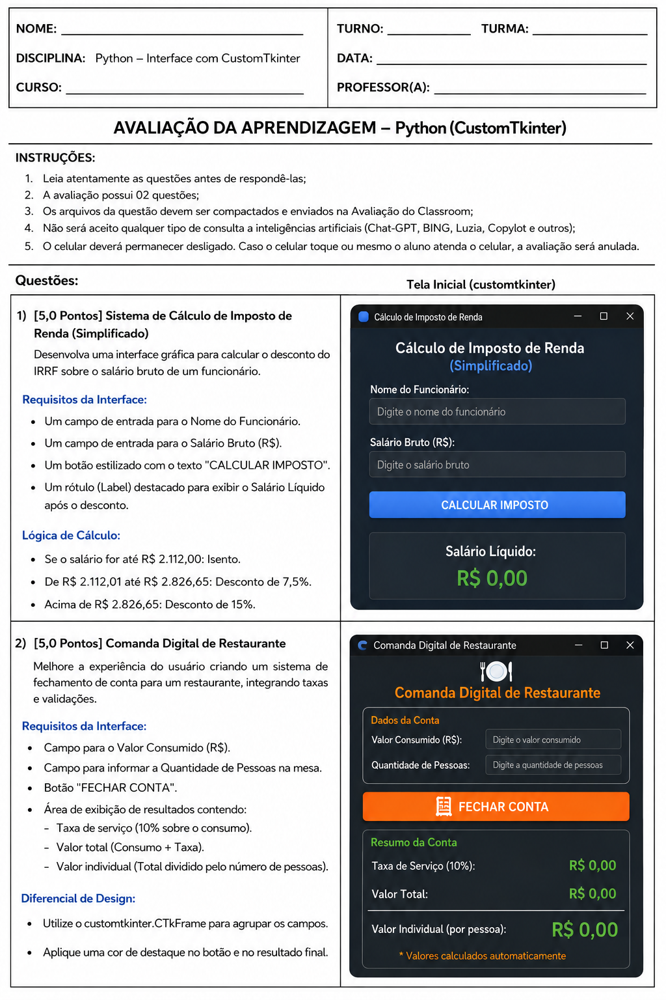

# Avaliação de Aprendizagem - Python (CustomTkinter)

### Discentes:
- Andre Junio Deomondes Carvalhal
- Eduardo Cavalcante Andrade



### Código

```

calculo_imposto_renda.py
comanda_digital_restaurante.py

```

### Rodar

```

python calculo_imposto_renda.py
python comanda_digital_restaurante.py

```

### Arquivos executáveis

```

executaveis\calculo_imposto_renda.exe
executaveis\calculo_imposto_renda.exe

```


